<div align="center">

# INVESTRO

### India's Next-Generation Trading & Investment Ecosystem

**A production-grade full-stack fintech platform — engineered for speed, transparency, and modern retail investing.**

<br />

[](https://react.dev/)
[](https://nodejs.org/)
[](https://www.mongodb.com/)
[](https://jwt.io/)
[](https://www.chartjs.org/)

[](https://github.com/rajayush6200/investro)
[](#responsive-design)
[](#dark-mode-system)
[](#license)
[](#roadmap)

<br />

[**Live Demo**](https://investro.onrender.com/) · [**Features**](#features) · [**Architecture**](#architecture) · [**Setup**](#installation--local-development) · [**API**](#api-reference) · [**Roadmap**](#roadmap)

<br />


<br />

<em>Built with precision. Designed for scale. Inspired by India's next 100 million investors.</em>

---

</div>

## Table of Contents

- [Overview](#overview)
- [Why INVESTRO?](#why-investro)
- [Features](#features)
  - [Platform & Trading UI](#platform--trading-ui)
  - [Authentication & Data](#authentication--data)
  - [UI / UX Excellence](#ui--ux-excellence)
- [Screenshots](#screenshots)
  - [Desktop Views](#-desktop-views)
  - [Mobile View](#-mobile-view)
- [Tech Stack](#tech-stack)
  - [Frontend](#frontend-landing---frontend)
  - [Dashboard](#dashboard-terminal---dashboard)
  - [Backend](#backend-backend)
  - [DevOps & Tooling](#devops--tooling)
- [Architecture](#architecture)
- [System Diagrams](#system-diagrams)
  - [High-Level Request Lifecycle](#high-level-request-lifecycle)
  - [Authentication Flow](#authentication-flow)
  - [Frontend ↔ Backend Communication](#frontend--backend-communication)
  - [MongoDB Schema Relationships](#mongodb-schema-relationships)
  - [Deployment Architecture](#deployment-architecture)
  - [Dark Mode Theme Flow](#dark-mode-theme-flow)
- [Folder Structure](#folder-structure)
- [Auth Implementation](#auth-implementation)
- [API Reference](#api-reference)
  - [Public Routes](#public-routes)
  - [Protected Routes](#protected-routes-authorization-bearer-token)
- [Database Design](#database-design)
- [Dark Mode System](#dark-mode-system)
- [Responsive Design](#responsive-design)
- [Security](#security)
- [Performance & UX](#performance--ux)
- [Developer Experience](#developer-experience)
- [Installation & Local Development](#installation--local-development)
  - [Prerequisites](#prerequisites)
  - [1. Clone the Repository](#1-clone-the-repository)
  - [2. Backend Setup](#2-backend-setup)
  - [3. Frontend Setup](#3-frontend-setup)
  - [4. Dashboard Setup](#4-dashboard-setup)
  - [5. Verify the Stack](#5-verify-the-stack)
- [Environment Variables](#environment-variables)
- [Production Deployment](#production-deployment)
  - [Deployment Checklist](#deployment-checklist)
  - [Build Commands](#build-commands)
- [Challenges Solved](#challenges-solved)
- [Learning Outcomes](#learning-outcomes)
- [Scalability Vision](#scalability-vision)
- [Roadmap](#roadmap)
- [Contributing](#contributing)
- [License](#license)
- [Author](#author)

---

## Overview

**INVESTRO** is a full-stack **fintech trading platform** that replicates the core experience of a modern discount broker — landing experience, authenticated trading dashboard, portfolio views, order management, and a real-time-style watchlist UI.

The platform is architected as a **multi-app MERN system**:

| Application | Port (dev) | Role |
|-------------|------------|------|
| **Frontend** | `3000` | Marketing site, auth, product pages |
| **Dashboard** | `3001` | Trading terminal UI |
| **Backend API** | `4000` | REST API, JWT auth, MongoDB |

This is not a tutorial clone — it is a **portfolio-grade, startup-quality** codebase with separated concerns, protected routes, persistent theming, responsive layouts, and production deployment targets on **Render**.

---

## Why INVESTRO?

India's retail investing boom deserves platforms that are **fast, transparent, and accessible** — not cluttered, expensive, or opaque.

INVESTRO was built to demonstrate:

| Pillar | What it proves |
|--------|----------------|
| **Product vision** | End-to-end fintech UX from landing → signup → trading dashboard |
| **Engineering depth** | Multi-client architecture, JWT security, MongoDB modeling |
| **Design quality** | Premium UI, dark mode, mobile-first watchlist & tables |
| **Scalability mindset** | Modular apps ready for WebSockets, payments, and cloud scale |

> *"Markets shouldn't be intimidating. INVESTRO exists to make sure they aren't."*  
> — Ayush Raj, Founder

The long-term goal is a **full operating system for personal finance** — execution, analytics, education, and community in one cohesive ecosystem.

---

## Features

### Platform & Trading UI

| Feature | Description |
|---------|-------------|
| **Trading Dashboard** | Multi-route terminal: Summary, Orders, Holdings, Positions, Funds, Apps |
| **Watchlist** | Searchable stock list with Buy/Sell actions, doughnut chart analytics |
| **Order Windows** | Draggable Buy/Sell modals with quantity & price inputs |
| **Holdings & Positions** | Live API-driven tables + mobile card layouts |
| **Market Indices Bar** | NIFTY / SENSEX top bar (UI-ready for live feeds) |
| **Portfolio Charts** | Chart.js bar & doughnut charts with theme-aware styling |

### Authentication & Data

| Feature | Description |
|---------|-------------|
| **JWT Authentication** | Bearer token flow with `Authorization` header |
| **Protected API Routes** | Middleware-guarded holdings, orders, positions |
| **User-scoped Orders** | Orders filtered by `userId` in MongoDB |
| **Bcrypt Password Hashing** | Pre-save hook with salt rounds |
| **Cross-app Auth Handoff** | Token passed from landing login → dashboard via URL + `localStorage` |

### UI / UX Excellence

| Feature | Description |
|---------|-------------|
| **Dual Theme (Light / Dark)** | CSS variables + `data-theme` with `localStorage` persistence |
| **Bootstrap 5 Landing** | Professional marketing pages (About, Pricing, Product, Support) |
| **Fully Responsive** | Mobile watchlist drawer, collapsible nav, data cards on small screens |
| **Toast Notifications** | Login/signup feedback via React Toastify |
| **Smooth Transitions** | Theme toggle animations, hover states, drawer slide-ins |

---

## Screenshots

### 💻 Desktop Views

<table width="100%">
  <tr>
    <td width="50%" align="center" valign="top">
      <strong>Homepage</strong><br/><br/>
      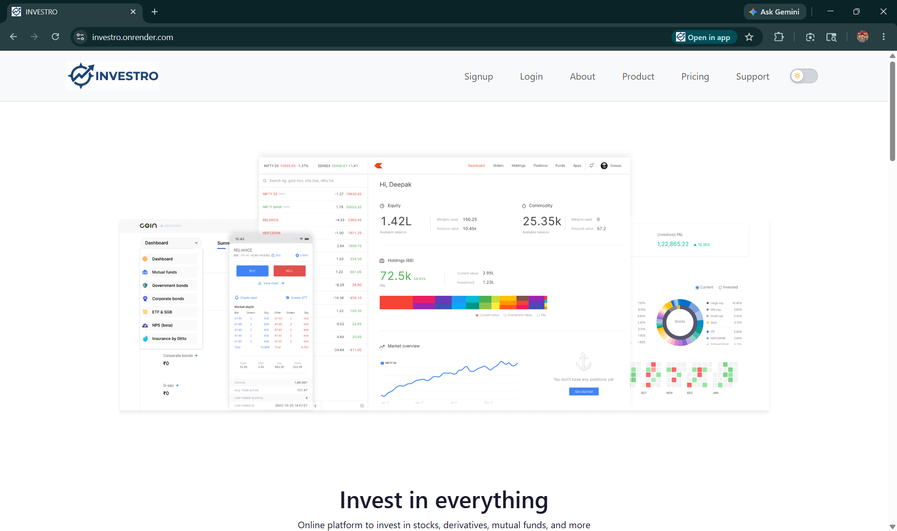
    </td>
    <td width="50%" align="center" valign="top">
      <strong>Trading Dashboard</strong><br/><br/>
      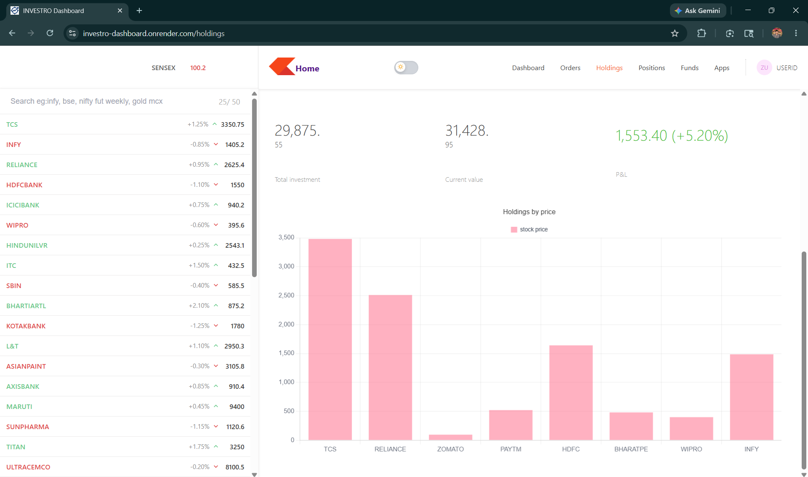
    </td>
  </tr>
  <tr>
    <td width="50%" align="center" valign="top">
      <strong>Dark Mode</strong><br/><br/>
      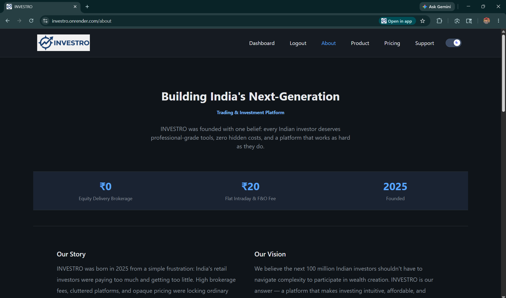
    </td>
    <td width="50%" align="center" valign="top">
      <strong>Watchlist</strong><br/><br/>
      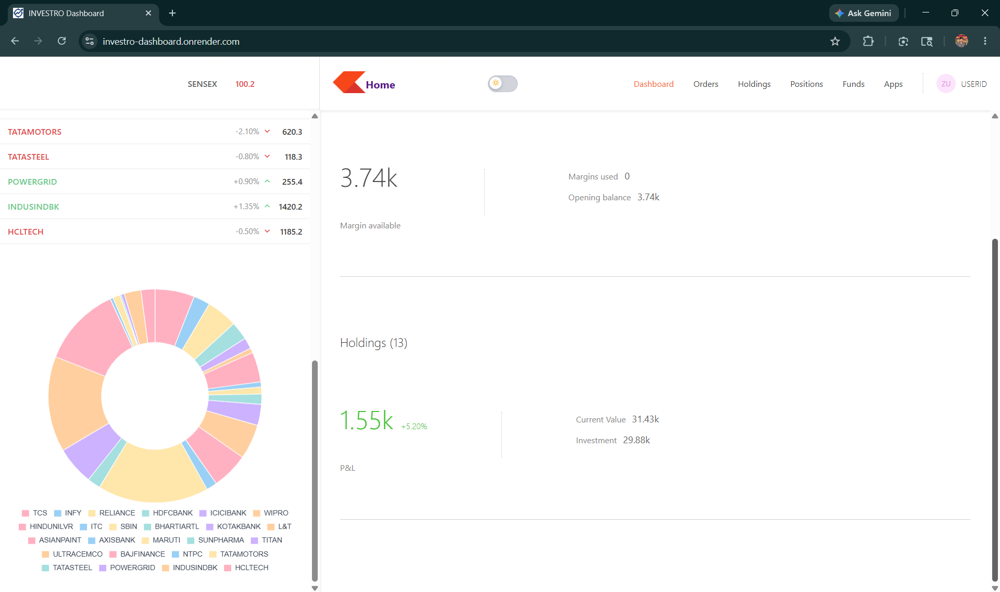
    </td>
  </tr>
  <tr>
    <td width="50%" align="center" valign="top">
      <strong>Authentication</strong><br/><br/>
      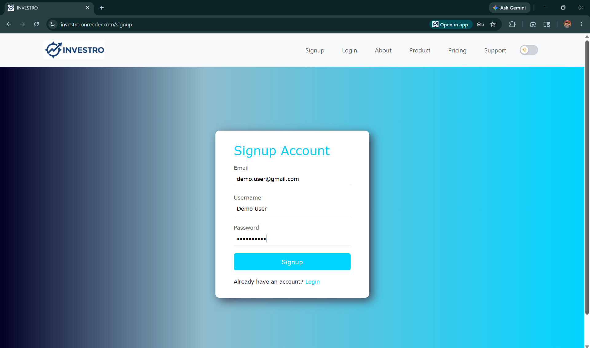
    </td>
    <td width="50%" align="center" valign="top">
      <strong>Buy / Sell Modal</strong><br/><br/>
      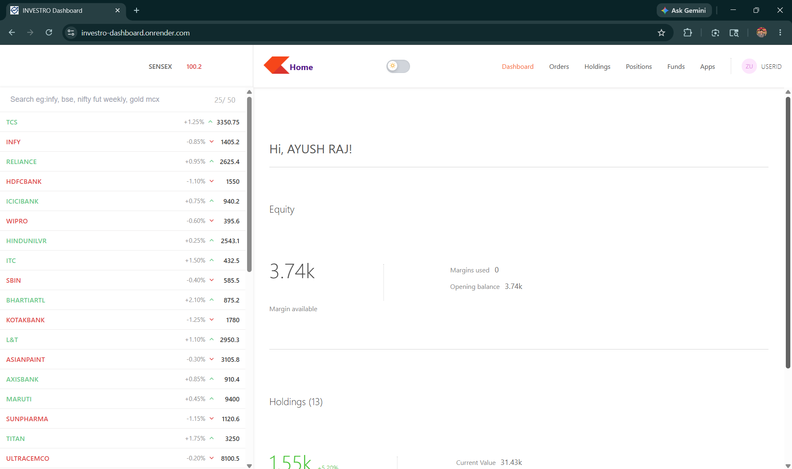
    </td>
  </tr>
</table>

### 📱 Mobile View

<div align="center">
  <table>
    <tr>
      <td align="center" valign="top">
        <strong>Mobile Layout</strong><br/><br/>
        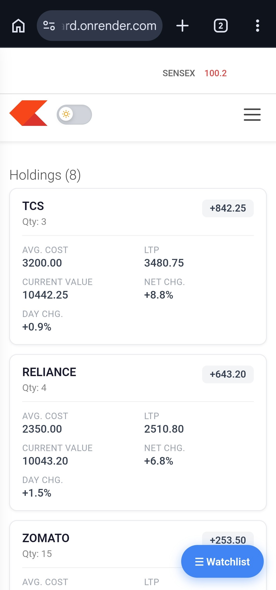
      </td>
    </tr>
  </table>
</div>

---

## Tech Stack

### Frontend (Landing — `frontend/`)

| Technology | Purpose |
|------------|---------|
| React 19 | UI library |
| React Router 7 | Client-side routing |
| Bootstrap 5 | Layout & components |
| Axios | HTTP client |
| React Toastify | Auth notifications |
| CSS Variables | Theme system |

### Dashboard (Terminal — `dashboard/`)

| Technology | Purpose |
|------------|---------|
| React 18 | UI library |
| React Router 6 | Dashboard sub-routes |
| Material UI (MUI) | Icons, tooltips, grow animations |
| Chart.js + react-chartjs-2 | Holdings & watchlist charts |
| Context API | Buy/Sell window state |

### Backend (`backend/`)

| Technology | Purpose |
|------------|---------|
| Node.js + Express 5 | REST API |
| MongoDB + Mongoose | Database ODM |
| JWT | Stateless authentication |
| bcryptjs | Password hashing |
| CORS + cookie-parser | Cross-origin & session-ready |

### DevOps & Tooling

| Tool | Purpose |
|------|---------|
| MongoDB Atlas | Cloud database |
| Render | Frontend, dashboard & API hosting |
| nodemon | API hot-reload in development |

---

## Architecture

INVESTRO follows a **decoupled three-tier architecture** — two React SPAs sharing one Express API and one MongoDB cluster.

```text
┌─────────────────────────────────────────────────────────────────────────┐
│                           CLIENT LAYER                                  │
├──────────────────────────────┬──────────────────────────────────────────┤
│   Landing App (:3000)        │   Trading Dashboard (:3001)              │
│   • Marketing pages          │   • Summary / Orders / Holdings          │
│   • Login / Signup           │   • Watchlist + Buy/Sell modals          │
│   • ThemeProvider            │   • Chart.js analytics                   │
└──────────────┬───────────────┴──────────────────┬───────────────────────┘
               │         HTTPS / REST + JWT        │
               ▼                                   ▼
┌─────────────────────────────────────────────────────────────────────────┐
│                    API LAYER — Express (:4000)                          │
│   /login  /signup  /dashboard  /allHoldings  /allOrders  /newOrder ...  │
│   verifyUser middleware → JWT decode → req.userId                     │
└──────────────────────────────┬──────────────────────────────────────────┘
                               │ Mongoose ODM
                               ▼
┌─────────────────────────────────────────────────────────────────────────┐
│                    DATA LAYER — MongoDB Atlas                           │
│   investro DB → users | holdings | positions | orders                   │
└─────────────────────────────────────────────────────────────────────────┘
```

---

## System Diagrams

### High-Level Request Lifecycle

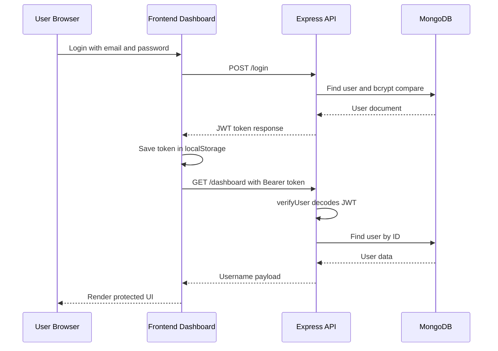

### Authentication Flow

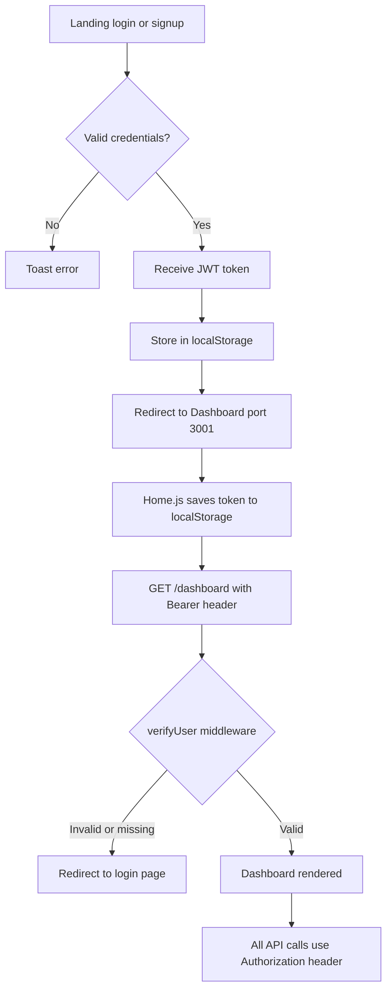

### Frontend ↔ Backend Communication

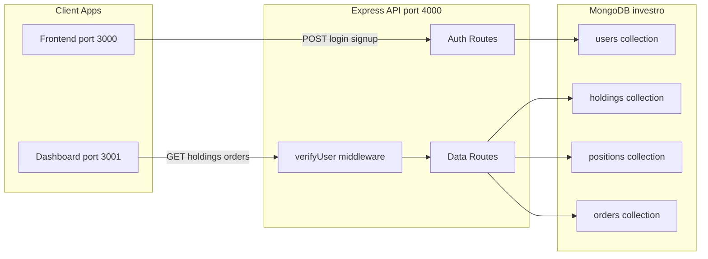

### MongoDB Schema Relationships

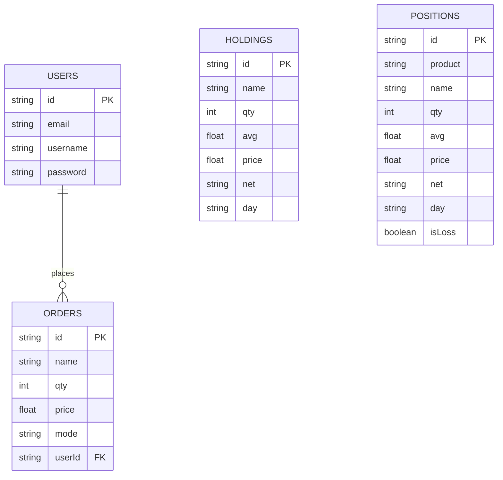

### Deployment Architecture

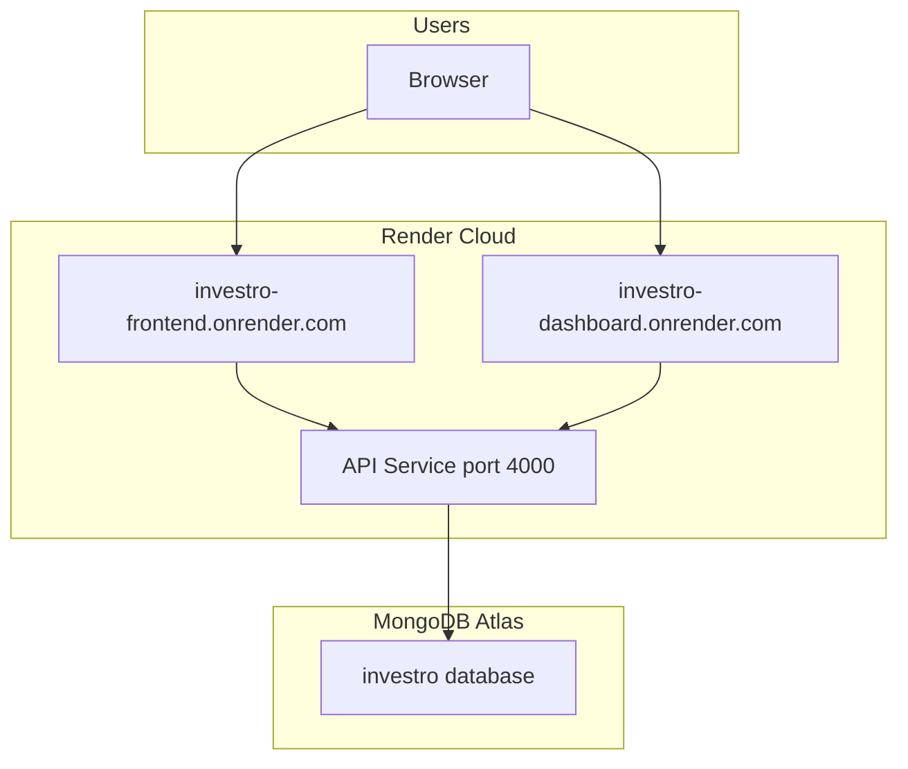

### Dark Mode Theme Flow

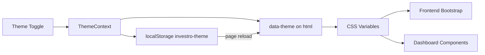

---

## Folder Structure

```text
investro/
├── frontend/                    # Landing & marketing SPA (React 19)
│   ├── public/
│   │   └── media/images/        # Logos, hero assets
│   └── src/
│       ├── landing_page/        # Pages: home, about, pricing, auth...
│       ├── theme/               # ThemeProvider, toggle, CSS variables
│       ├── App.js
│       └── index.js
│
├── dashboard/                   # Trading terminal SPA (React 18)
│   ├── public/
│   └── src/
│       ├── components/          # WatchList, Holdings, Orders, modals...
│       ├── theme/               # Dark mode + chart theming
│       ├── data/                # Static watchlist seed data
│       └── index.js
│
├── backend/                     # Express REST API
│   ├── index.js                 # Routes & server entry
│   ├── middleware/
│   │   └── authMiddleware.js    # JWT Bearer verification
│   ├── model/                   # Mongoose models
│   ├── schemas/                 # Schema definitions
│   ├── util/
│   │   └── token.js             # JWT sign helper
│   └── seed.js                  # Holdings & positions seeder
│
├── docs/
│   └── screenshots/             # README gallery assets (add images here)
│
└── README.md
```

<details>
<summary><strong>📂 Dashboard routes</strong></summary>

| Route | Component |
|-------|-----------|
| `/` | Summary |
| `/orders` | Orders |
| `/holdings` | Holdings + bar chart |
| `/positions` | Positions |
| `/funds` | Funds |
| `/apps` | Apps |

</details>

<details>
<summary><strong>📂 Landing routes</strong></summary>

| Route | Page |
|-------|------|
| `/` | Home |
| `/about` | About |
| `/product` | Product |
| `/pricing` | Pricing |
| `/support` | Support |
| `/login` | Login |
| `/signup` | Signup |
| `/privacy` | Privacy Policy |
| `/terms` | Terms of Service |

</details>

---

## Auth Implementation

1. User submits credentials on **Login** or **Signup** (`frontend`).
2. API validates input, hashes passwords on registration (`bcrypt` pre-save hook).
3. Server returns a **JWT** (`createToken`, 3-day expiry).
4. Client stores token in **`localStorage`**.
5. User is redirected to **Dashboard** with optional `?token=` query param for handoff.
6. `Home.js` validates token via `GET /dashboard` before rendering the terminal.
7. All protected requests send: `Authorization: Bearer <token>`.
8. `verifyUser` middleware decodes JWT and attaches `req.userId` to the request.

---

## API Reference

### Public Routes

| Method | Endpoint | Description |
|--------|----------|-------------|
| `GET` | `/` | Health check |
| `GET` | `/test` | Test endpoint |
| `POST` | `/login` | Authenticate user → returns JWT |
| `POST` | `/signup` | Register user → returns JWT |
| `GET` | `/logout` | Clear cookie (legacy) |

### Protected Routes (`Authorization: Bearer <token>`)

| Method | Endpoint | Description |
|--------|----------|-------------|
| `GET` | `/dashboard` | Current user profile |
| `GET` | `/allHoldings` | Portfolio holdings |
| `GET` | `/allPositions` | Open positions |
| `GET` | `/allOrders` | User-scoped order history |
| `POST` | `/newOrder` | Place BUY / SELL order |

### Example — Login

```bash
curl -X POST https://investro-api.onrender.com/login \
  -H "Content-Type: application/json" \
  -d '{"email":"user@example.com","password":"yourpassword"}'
```

```json
{
  "success": true,
  "token": "eyJhbGciOiJIUzI1NiIsInR5cCI6IkpXVCJ9..."
}
```

### Example — Protected Request

```bash
curl https://investro-api.onrender.com/allOrders \
  -H "Authorization: Bearer YOUR_JWT_TOKEN"
```

---

## Database Design

**Database name:** `investro` (MongoDB Atlas)

| Collection | Key Fields | Notes |
|------------|------------|-------|
| `users` | `email`, `username`, `password` | Unique email; password hashed on save |
| `holdings` | `name`, `qty`, `avg`, `price`, `net`, `day` | Portfolio display data |
| `positions` | `product`, `name`, `qty`, `avg`, `price`, `isLoss` | Intraday/CNC positions |
| `orders` | `name`, `qty`, `price`, `mode`, `userId` | Scoped per authenticated user |

### Seed Demo Data

```bash
cd backend
node seed.js
```

Populates sample **holdings** and **positions** for dashboard development.

---

## Dark Mode System

INVESTRO ships a **unified theme engine** across both React apps.

| Aspect | Implementation |
|--------|----------------|
| **Storage key** | `investro-theme` (`light` \| `dark`) |
| **DOM attribute** | `data-theme` on `<html>` |
| **Bootstrap** | `data-bs-theme` on landing app |
| **Flash prevention** | Inline script in `index.html` before React hydration |
| **Persistence** | `localStorage` survives refresh & cross-tab |
| **Charts** | `useChartTheme()` — legend, grid, tooltip colors adapt |
| **CSS** | Custom properties in `theme.css` & `dashboard-dark.css` |

Toggle locations: **Landing navbar** · **Dashboard menu bar**

---

## Responsive Design

| Breakpoint | Behavior |
|------------|----------|
| **Desktop** | Side-by-side watchlist + content; hover Buy/Sell on watchlist rows |
| **Tablet** | Condensed menu; flexible data tables |
| **Mobile** | Hamburger nav; **slide-out watchlist drawer**; table → **card layout**; floating watchlist FAB |

Engineered for touch: action buttons remain accessible without hover on mobile.

---

## Security

| Measure | Status |
|---------|--------|
| Password hashing (bcrypt, 12 rounds) | Implemented |
| JWT with secret (`TOKEN_KEY`) | Implemented |
| Protected route middleware | Implemented |
| CORS whitelist (Render production origins) | Implemented |
| User-scoped orders query | Implemented |
| Bearer token (not cookie-only) | Implemented |

**Recommended hardening for production:**

- Rate limiting on `/login` and `/signup`
- Helmet.js security headers
- Input validation (e.g. Zod / express-validator)
- HTTPS-only deployments
- Rotate `TOKEN_KEY` via secrets manager

---

## Performance & UX

- **Code splitting** via Create React App build pipeline
- **CSS variable theming** — O(1) theme switch without re-render storms
- **Chart.js** `responsive: true` for fluid analytics
- **Sticky mobile headers** on watchlist drawer
- **Minimal layout shift** — theme applied before paint
- **Lazy-friendly structure** — components scoped per route

---

## Developer Experience

| Principle | How INVESTRO applies it |
|-----------|-------------------------|
| **Separation of concerns** | 3 independent apps with clear boundaries |
| **Reusable theme module** | `ThemeProvider`, `ThemeToggle`, `useChartTheme` |
| **Context for UI state** | `GeneralContext` — Buy/Sell window orchestration |
| **Schema / model split** | Mongoose schemas decoupled from model files |
| **Seed script** | One-command demo data for holdings & positions |
| **Consistent API patterns** | Axios + Bearer header across dashboard |

```bash
# Typical dev session — 3 terminals
cd backend   && npm start    # :4000
cd frontend  && npm start    # :3000
cd dashboard && npm start    # :3001
```

---

## Installation & Local Development

### Prerequisites

- **Node.js** 18+
- **npm** 9+
- **MongoDB Atlas** account (or local MongoDB)

### 1. Clone the Repository

```bash
git clone https://github.com/rajayush6200/investro.git
cd investro
```

### 2. Backend Setup

```bash
cd backend
npm install
```

Create `backend/.env`:

```env
MONGO_URL=mongodb+srv://<user>:<password>@cluster.mongodb.net/?retryWrites=true&w=majority
TOKEN_KEY=your_super_secret_jwt_key_min_32_chars
PORT=4000
```

```bash
npm start
node seed.js   # optional: seed holdings & positions
```

### 3. Frontend Setup

```bash
cd frontend
npm install
npm start
```

Opens at **https://investro.onrender.com** (production) or `http://localhost:3000` (local dev)

### 4. Dashboard Setup

```bash
cd dashboard
npm install
npm start
```

Opens at **https://investro-dashboard.onrender.com** (production) or `http://localhost:3001` (local dev)

### 5. Verify the Stack

| Check | URL |
|-------|-----|
| API health | https://investro-api.onrender.com/ |
| Landing | https://investro.onrender.com/ |
| Dashboard | https://investro-dashboard.onrender.com/ (after login) |

---

## Environment Variables

### Backend (`backend/.env`)

| Variable | Required | Description |
|----------|----------|-------------|
| `MONGO_URL` | Yes | MongoDB Atlas connection string |
| `TOKEN_KEY` | Yes | JWT signing secret |
| `PORT` | No | Server port (default `4000`) |

### Frontend / Dashboard

Production URLs are centralized in `frontend/src/config/urls.js` and `dashboard/src/config/urls.js`:

| Constant | Production URL |
|----------|----------------|
| `API_BASE_URL` | `https://investro-api.onrender.com` |
| `FRONTEND_URL` | `https://investro.onrender.com` |
| `DASHBOARD_URL` | `https://investro-dashboard.onrender.com` |

> **Tip:** For local development, temporarily point these constants at `http://localhost:4000`, `http://localhost:3000`, and `http://localhost:3001`, or switch to `REACT_APP_*` env vars.

---

## Production Deployment

INVESTRO is configured for **Render** (URLs whitelisted in backend CORS):

| Service | Production URL |
|---------|----------------|
| Frontend | `https://investro.onrender.com` |
| Dashboard | `https://investro-dashboard.onrender.com` |
| API | `https://investro-api.onrender.com` |

### Deployment Checklist

1. Deploy **backend** → set `MONGO_URL`, `TOKEN_KEY`, `PORT`
2. Deploy **frontend** & **dashboard** as static sites
3. Update CORS `origin` array in `backend/index.js` with production URLs
4. Point React apps to production API URL
5. Run `node seed.js` once against production DB (dev/staging only)

### Build Commands

```bash
# Frontend
cd frontend && npm run build

# Dashboard
cd dashboard && npm run build
```

---

## Challenges Solved

| Challenge | Solution |
|-----------|----------|
| **Two React apps, one auth session** | JWT in `localStorage` + URL token handoff on login redirect |
| **Cross-origin API calls** | Express CORS with credentials + explicit origin whitelist |
| **Theme flash on reload** | Synchronous `localStorage` read in `index.html` before React mount |
| **Mobile trading UX** | Watchlist drawer, card-based tables, touch-friendly action buttons |
| **Inline styles breaking dark mode** | CSS variable classes in `about.css` |
| **Chart readability in dark theme** | `useChartTheme()` hook for Chart.js options |

---

## Learning Outcomes

Building INVESTRO demonstrates proficiency in:

- Full-stack **MERN** architecture with **multiple frontend clients**
- **JWT-based stateless authentication** and protected REST design
- **MongoDB** schema modeling and user-scoped queries
- **Advanced CSS** — variables, responsive layouts, dual themes
- **Component-driven UI** — modals, context, charts, mobile drawers
- **Production deployment** awareness (CORS, env config, cloud DB)

---

## Scalability Vision

```text
Current State          →          Target Scale
─────────────────────────────────────────────────
REST polling           →          WebSocket live ticks
Static watchlist       →          NSE/BSE market data APIs
Single API instance    →          Horizontally scaled Node cluster
MongoDB documents      →          Redis cache + read replicas
Manual orders          →          Order matching engine integration
```

The codebase is structured so each layer can evolve **without rewriting the product surface**.

---

## Roadmap

| Phase | Milestone | Status |
|-------|-----------|--------|
| **v1.0** | Landing + Dashboard + JWT + MongoDB | Done |
| **v1.1** | Dark mode + responsive watchlist | Done |
| **v1.2** | Centralized API env config | Planned |
| **v2.0** | Real-time stock API integration | Planned |
| **v2.1** | WebSocket price streaming | Planned |
| **v2.2** | Portfolio P&L analytics dashboard | Planned |
| **v3.0** | Payment gateway & fund management | Planned |
| **v3.1** | Push / email notifications | Planned |
| **v4.0** | AI trade insights & risk scoring | Planned |
| **v4.1** | React Native mobile app | Planned |
| **v5.0** | Multi-region cloud deployment (AWS/GCP) | Planned |

---

## Contributing

Contributions are welcome. This project is ideal for issues around UI polish, API hardening, and test coverage.

1. Fork the repository
2. Create a feature branch: `git checkout -b feature/amazing-feature`
3. Commit: `git commit -m 'Add amazing feature'`
4. Push: `git push origin feature/amazing-feature`
5. Open a Pull Request

Please follow existing code style and keep PRs focused.

---

## License

Distributed under the **MIT License**. See `LICENSE` for full text.

```
MIT License — Copyright (c) 2026 Ayush Raj
```

---

## Author

<div align="center">

**Ayush Raj**  
Founder & Engineer — INVESTRO

[](https://github.com/rajayush6200)
[](https://www.linkedin.com/in/rajayush6200/)
[](mailto:rajayush6200@gmail.com)

<br />

*If INVESTRO helped you learn or inspired a project — consider starring the repo.*

<br />

**⭐ Star this repository if you find it valuable!**

</div>

---

<div align="center">

<sub>Built with discipline. Designed for India's next generation of investors.</sub>

**INVESTRO** · © 2026 Ayush Raj · All rights reserved.

</div>

